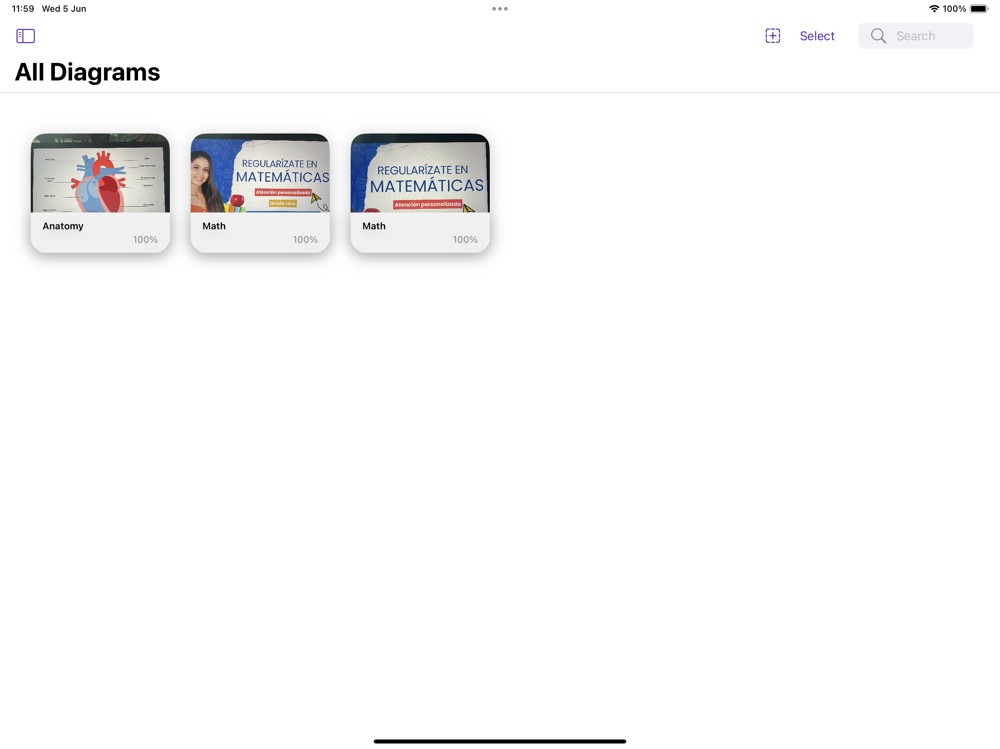

# Eyedia 📚

**Eyedia** is an innovative app designed to help you study more efficiently. With Eyedia, you can digitize any diagram and automatically recognize the text of all labels, allowing you to quickly and effectively practice and memorize each term.

## Features ✨

- **Automatic Text Recognition** 📷: Take a photo of any diagram and Eyedia will automatically recognize all the words.
- **Word Hiding** 🕵️‍♂️: All words in the diagram will be automatically hidden so you can challenge your memory.
- **Personalized Quizzes** 🎓: Start your study session with quizzes that offer 3 levels of difficulty based on your progress.

## Screenshots 📸

## Installation 📲

You can download Eyedia directly from the [App Store](https://www.apple.com/app-store/).

## Usage 🚀

1. **Take a Photo**: Open the app and take a photo of your diagram.
2. **Recognize Text**: Let Eyedia process the image and automatically recognize all the words.
3. **Start Quiz**: Begin your study session with the words hidden. The difficulty level will adjust automatically according to your progress.

## Credits 🙌

Developed by:
- Carmine Iemmino
- Fernanda Lozoya
- Francesca Pia De Rosa
- Miguel Torres
- Vitor Gebrin
- Yatziri Pineda

